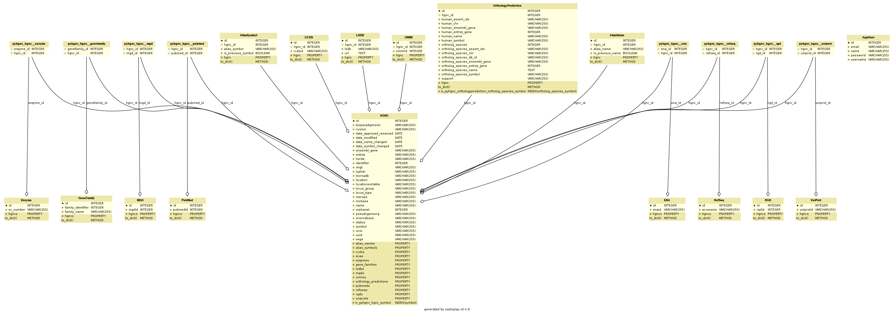

PyHGNC Documentation
====================
for version: |release|

**PyHGNC** is a python software interface developed by the
`Department of Bioinformatics <https://www.scai.fraunhofer.de/en/business-research-areas/bioinformatics.html>`_
at the Fraunhofer Institute for Algorithms and Scientific Computing
`SCAI <https://www.scai.fraunhofer.de/en.html>`_
for the data provided by the `European Bioinformatics Institute (EMBL-EBI) <http://www.ebi.ac.uk/>`_ on their
`HGNC website <http://www.genenames.org/>`_. Thanks to the significant and important work of the
`HUGO Gene Nomenclature Committee <https://www.ebi.ac.uk/services/teams/hgnc>`_ the scientific community has an
essential standardised nomenclature for human genes in hand. Because in many software projects a local installation with
fast programmatic access is required, we have developed a Python library which allows to access and query HGNC data
locally with very limited programming skills.

For the impatient user: on your console

.. code-block:: sh

   pip install pyhgnc
   pyhgnc update

... in your Python console

.. code-block:: python

   import pyhgnc
   query = pyhgnc.query()
   query.hgnc()

The content of HGNC made easy accessible by PyHGNC supports
successfully scientists in the `IMI <https://www.imi.europa.eu/>`_ funded projects
`AETIONOMY <http://www.aetionomy.eu/>`_  and `PHAGO <https://www.imi.europa.eu/content/phago>`_.
It is used for the identification of potential drugs in complex disease networks with several thousand relationships
compiled from `BEL <http://openbel.org/>`_ statements.

Aim of this software project is to provide an programmatic access to locally stored HGNC data and
allow a filtered export in several formats used in the scientific community. Query functions allow to search in the
data and use it as `pandas.DataFrame` in `Jupyter <http://jupyter.org/>`_ notebooks.
We will focus our software development on the analysis and extension of biological disease knowledge networks.
PyHGNC is an ongoing project and needs improvement. We are happy if you want to support our project or start
a scientific cooperation with us.

**Fig. 1**: ER model of PyHGNC database

- supported by `IMI <https://www.imi.europa.eu/>`_, `AETIONOMY <http://www.aetionomy.eu/>`_, `PHAGO <https://www.imi.europa.eu/content/phago>`_.

.. image:: _static/logos/imi-logo.png
   :width: 150 px
   :target: pageapplet/index.html

.. image:: _static/logos/aetionomy-logo.png
   :width: 150 px
   :target: pageapplet/index.html

.. image:: _static/logos/scai-logo.svg
   :width: 150 px
   :target: pageapplet/index.html

.. toctree::
   :numbered:
   :maxdepth: 2

   installation
   tutorial
   query_functions
   restful_api
   hgnc
   benchmarks

.. toctree::
   :caption: Reference
   :name: reference

   query
   models

.. toctree::
   :numbered:
   :caption: Project
   :name: project

   roadmap
   technology

Acknowledgment and contribution to scientific projects
------------------------------------------------------

*Software development by:*

* `Christian Ebeling <https://www.scai.fraunhofer.de/de/ueber-uns/mitarbeiter/ebeling.html>`_

The software development of PyHGNC by Fraunhofer Institute for Algorithms and Scientific Computing (SCAI) is supported
and funded by the `IMI <https://www.imi.europa.eu/>`_
(INNOVATIVE MEDICINES INITIATIVE) projects `AETIONOMY <http://www.aetionomy.eu/>`_  and
`PHAGO <https://www.imi.europa.eu/content/phago>`_. The aim of both projects is the identification of mechnisms in
Alzhiemer's and Parkinson's disease in complex biological `BEL <http://openbel.org/>`_ networks for drug development.

Indices and Tables
------------------

* :ref:`genindex`
* :ref:`modindex`
* :ref:`search`